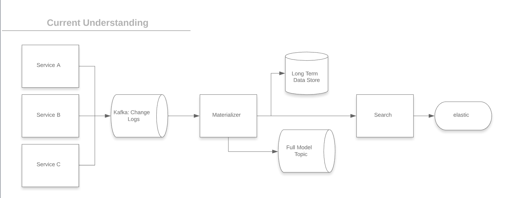
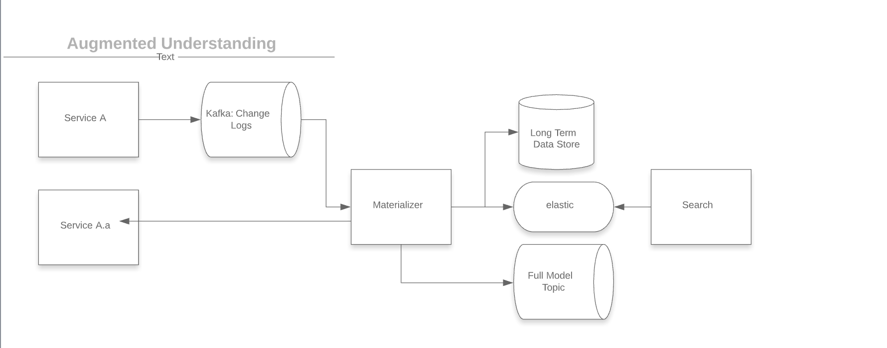

# materializer
The RFC written by Evan can be found [here](https://github.com/sailpoint/saas-rfcs/blob/master/text/0013-eng_model_materializer.md).
The purpose of this page is to illustrate what my understanding of the materializer is, as well as purpose a few new ideas and their rational.

## Understanding of Materializer based on RFC

### High Level Understand:
1. User interacts with Service A,B,C, which will then generate a change log which will be sent to kafka.
2. Materializer consumes from the kafka change log, builds out models. Models are sent to a long term storage syste, a model kafka topic, and the search system.
3. Search builds out the full model required by elastic and saves to elastic.

### Challanges / Questions
1. How do we boot strap the models once this service is turned on, if we only have changes, we have no initial state.
2. How do we scale model understanding in the materializer.
3. How hard is this going to effect search if it has to save to elastic.
4. What happens when we get kafka events out of order.
5. What is the required SLA, kafka topics can build up pretty high lag, especially where user events are concerned.

## Slightly different design

### High Level Understand:
1. User interacts with Service A,B,C, which will then generate a change log which will be sent to kafka.
2. Materializer consumes from the kafka change long, based on the event, calls to the service with a full understanding of the model.
3. Materializer transforms source model to required elastic model.
4. Materializer saves transformed model to elastic.
5. Search queries from elastic as needed.

### Challanges / Questions
1. Do services with a full understanding of model exist? 

### Why this is attractive
1. We do not have to worry about events coming out of order, we can also window change events as traffic spikes.
2. We take strain off search as it no longer has to build the models
3. Materializer only needs 4 things for new entries:
    1. Input kafka topic and an event type
    2. Service to query to get full document
    3. Set of steps to transform full document to elastic entry
    4. Output topic as applicable